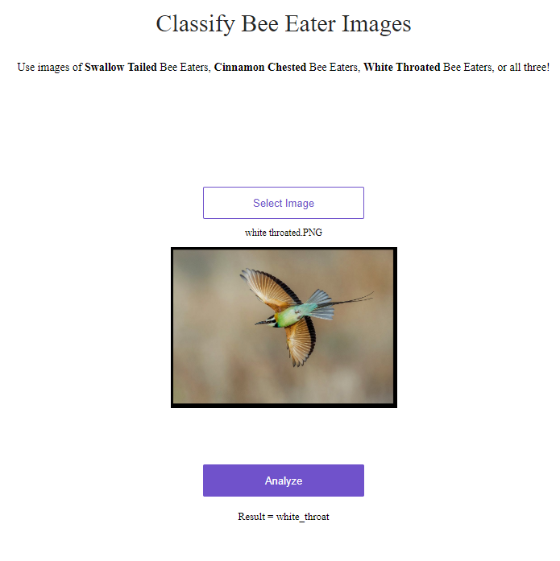

# Starter for deploying [fast.ai](https://www.fast.ai) models on [Render](https://render.com)

This repo can be used as a starting point to deploy [fast.ai](https://github.com/fastai/fastai) models on Render.

The sample app described here is up at https://fastai-v3.onrender.com. Test it out with bear images!

You can test your changes locally by installing Docker and using the following command:

```
docker build -t fastai-v3 . && docker run --rm -it -p 5000:5000 fastai-v3
```

The guide for production deployment to Render is at https://course.fast.ai/deployment_render.html.

Please use [Render's fast.ai forum thread](https://forums.fast.ai/t/deployment-platform-render/33953) for questions and support.


# Bee Eater Web App:

The Bee Eater Web app uses a ResNet34 transfer learning model to predict 3 different Bee Eater bird classes.
The bird images are extracted from google image search urls. 
There are 480 bird images (384 test set, 96 validation set) used to train the model.
The model was trained with 2 epochs on an unfrozen ResNet34 transfer learning model using SGD to find the learning rate.
The model has a final error rate of 10.4167%


* Web App is not currently deployed, the provided link will not work
The Bee Eater app can be found https://bird-predictor.onrender.com

* Web app image:

